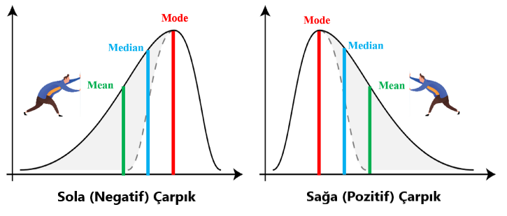

# Basic Statistics (Temel İstatistik)

İstatistiksel düşünce yöntemine sahip olmak kişilerin verilerle analiz sürecinde ilk adımdan son adıma kadar olan kısmı en doğru şekilde tamamlamalarını sağlar. İstatistik iki temel gruba ayrılır:

1. **Tanımlayıcı (Descriptive) İstatistik** : Verilerin toplanması, sunulması ve veri özelliklerinin belirlenmesi süreçlerini kapsar. Karmaşık halde bulunan veriden alınan özet bilgilerin belirlenmesi ve sayısal olarak ifade edilmesi için kullanılır.

2. **Çıkarımsal (Inferential) İstatistik** : Örneklem verilerine dayalı olarak ana kütle hakkında çıkarımlar yapmak, karar vermek ve sonuca bağlamak için kullanılır.

## İstatistikte Temel Kavramlar

### Popülasyon ve Örneklem (Population and Sample)

<div style="text-align:center"></div>

İstatistiksel bir araştırma konusunda, bahsi geçen bütün elementler **popülasyonu** (ana kütle, evren) oluşturur. Bu popülasyon içinden seçilen daha küçük ve spesifik gruba ise **örneklem** denir. Popülasyonun tümünden veri toplanırsa buna da **tamsayım** denir. <br>
Örneğin Türkiye’de yapılacak seçim sonucunun tahminine yönelik istatistiksel bir araştırma yapılmak istensin. Burada oy kullanacak olan bütün seçmenler _popülasyon'u_ oluşturur. Bütün popülasyona hangi partiye oy verileceği sorulamayacağından, bir alt küme (daha küçük bir grup) seçilir ve bu alt küme de _örneklem_ olarak adlandırılır.

#### Örneklem Kulanılma Nedenleri

- Bütünü incelemek oldukça zordur.
- Zamandan tasarruf edebilmek için. Bütünü incelemek fazlaca zamanımızı alacaktır.
- Maliyetten tasarruf edebilmek için. Bütünü incelerken zaman uzayacak ve doğru orantılı olarak maliyet artacaktır.

#### Örneklemin Özellikleri

- Örneklemin eşit ağırlıklı ve rastlantısal seçilmesi gerekir. Örneğin üleknin gelir durumu için araştırma yaparken ağırlıklı olarak zengin kesimden örneklem alınırsa araştırma doğru sonuç vermeyecektir.
- Örneklem ana kümeyi net olarak yansıtmaz.
- Örneklem büyüdükçe doğruluk oranı artar. Ancak maliyet ve zaman da doğru orantılı olacak şekilde artar.

#### Örneklem Çeşitleri

1. **Olasılığa Dayalı Teknikler** : Örnekler rastgele seçilir. Araştırmacı müdahalede bulunmaz.

    <div style="text-align:center"></div>

    1.1. **Basit Tesadüfi Örnekleme (Simple Random Sample)** : Popülasyon içinden rastgele örneklem seçme yöntemidir. <br>
    1.2. **Sistematik Örnekleme (Systematic Sampling)** : Ana kütle çok büyük olduğunda kullanılır. Ana kütleden belirli aralıklarla örnek seçilerek elde edilir.

    <div style="text-align:center"></div>

    1.3. **Tabakalı Örnekleme (Stratified Sampling)** : Özelliği anakütlenin içindeki bütün elamanlar belli özelliklere göre kendi içlerinde birbirlerine benzeyen birkaç gruptan, tabakadan oluştuklarıdır. Tabaka elemanları birbirlerine benzerler fakat diğer tabaka elemanlarından çok bariz şekilde değişiktirler. Tabaka örneğinde örnek elemanları öyle seçilmektedir ki her bir anakütle tabakası için örnekte temsilci bulunmaktadır. <br>
    1.4. **Küme Örnekleme (Cluster Sampling)** : Genel olarak bu yöntemin uygulanması anakütle içinde veri elamanları "kümeler" halinde ise uygundur. Bir küme içindeki elemanlar belirli karakter özelliklerine göre (çoğunlukla coğrafî alana göre) birbirine "yakınlık" göstermekte ve diğer anakütle içindeki kümelerden daha "uzak" olmaktadır.
2. **Olasılığa Dayalı Olmayan Teknikler** <br>
   2.1. **Kolayda Örnekleme** : Ankete cevap veren herkes örnekleme dahil edilir. <br>
   2.2. **Kasti Örnekleme** : Örneklem araştırmacının araştırma problemine cevap bulacağına inandığı kişilerden oluşur. <br>
   2.3. **Kota Örnekleme** : Önceden belirlenen kriterlere göre anakitleyi temsil edecek kişişlerden örneklem oluşturulur. <br>
   2.4. **Kartopu Örnekleme** : Örnekleme dahil edilecek ilk birey yargısal veya tesadüfi olarak seçilir. Ardından ikinci kişi ilk görüşülen kişinin yönlendirmesiyle seçilir. Üçüncü ikincinin, dördüncü üçüncünün derken büyük bir kartopu örneklemi oluşur.

### Gözlem Birimi (Unit of observation)

<p align="center"></p>

Analiz sürecinde, araştırma yapılacak alanda incelenen özelliği taşıyan ve bu özelliğin değerini sayısal olarak elde edebileceğimiz kaynağa denir. Örneğin üniversite sınavına girecekler ile ilgili yapılacak bir araştırmada yer alacak her bir öğrenci bizim gözlem birimimizdir.

### Parametre

Popülasyonun ölçülebilen, gözlemlenebilen, sayısal olarak ifade edebildiğimiz özellikleri ana kütlenin parametresi deriz. Parametrenin belirlenmesi için ana kütle içerisindeki tüm bilgilere ılaşılması gerekir. Ana kütle birden fazla parametreye sahip olabilir.

<p align="center"></p>

* Popülasyondan hesaplanan sayısal değerlere **parametre** denir. <br>
* Örneklemden elde edilen sayısal değerlere **istatistik** denir.

### Değişkenler

Gözlemden gözeleme değişiklik gösterebilen, yeni değerler alabilen ya da sabit kalabilen nesnelere ya da özelliklere değişken denir.

#### Değişken Türleri

- **Nicel Değişken** : Sayısal olarak ifade edilirler. Örnek.: yaş, kilo
- **Nitel Değişken** : Sözcük ve kelimelerle ifade edlien değişkenlere denir. Örnek.: cinsiyet, eğitim durumu
- **Sürekli Değişken** : Ölçüm veya gözlemelerde sırasında sınırsız değer alabilenlere sürekli değişken denir. Örnek.: yaş, akademik başarı
- **Kesikli Değişken** : Sınırlı sayıda değer alıyorsa kesikli değişkendir. Örnek.: cinsiyet, kan grubu
- **Bağımlı - Bağımsız Değişkenler** : Değişkenler neden sonuç ilişkisi içerisinde yer alıyor ve birbirlerinden etkileniyorsa bağımlı-bağımsız değişken vardır deriz.

<p align="center"></p>


### Ölçek Türleri

Ölçme faaliyetlerinin yerine getirilmesi için kullanılması gereken araçlar topluluğuna **ölçek** denir. Ölçek türlere ayrılır.

1. **Sınıflama Ölçekleri** : Bireylerin ya da nesnelerin kategorize edilerek, türlerine göre gruplandırılmasına dayanır. Matematiksel olarak işlem yapılamaz. Matematiksel olarak en az bilgiyi veren türdür. Ölçülecek değişken kategorik değerler alır. Ölçülecek değişkenin miktar olarak değerlendirilmesi yapIlamaz. Örnek: voleybol takımindaki oyunculara sayı numarası vererek sınıflandırmak, Kişileri saç renklerine göre sınıflandırmak.
2. **Sıralama Ölçekleri** : Bireyleri ya da nesneleri belirli özelliklerine göre ele alıp büyükten küçüğe ya da küçükten büyüğe siralayarak oluşturulan ölçek türüdür. Ölçme sonuçları üzerinde matematiksel işlemler yapamayız. Örnek: sınavdan alinan puana göre öğrencilerin başarı sıralamasını yapmak, iş yerinde kişileri boy sıralarına göre sıralamak, hastanede sıra numarası alarak sıralamak.
3. **Eşit Aralıklı Ölçekler** : Ölçülen özelliğin belirlenen bir başlangıç noktası ele alınarak eşit aralıklarla ölçülmesine denir. Ölçme sonuçları üzerinde matematiksek işlem olarak toplama çıkarma yapilabilir. Örnek: sınav puanlarina göre sınıftaki öğrenciler 10'ar gruplara ayırılıp ölçeklendirilebilir.
4. **Eşit Oranlı Ölçekler** : Ölçülen özelliğin belirlenen bir başlangıç noktası ele alınarak eşit oranlarda ölçülmesine denir. Ölçme sonuçları üzerinde matematiksek işlem olarak toplama çıkarma yapilabilir. Örnek: sınav puan aralıklarına göre sınıftaki öğrenciler 10'ar gruplara ayırılıp ölçeklendirilebilir.

## Tanımlayıcı İstatistik

<p align="center"></p>

### 1. Yer Ölçüleri

#### 1.1. Aritmetik Ortalama

Bir veri setindeki elemanların tamamının toplamının eleman sayısına bölümüne **aritmetik ortalama** denir. Aritmetik ortlama veri setinin denge noktasını göstermektedir. Ortalama hesaplanırken veri setindeki **outlier (aykırı)** verilerin elimine edilmiş olması önemlidir. Aksi halde bu aykırı değer ortalamayı dağılımdan çok daha farklı yerlere götürüp hatalı analizler yapılmasına sebep olabilir.

**Popülasyon Aritmetik Ortalama**

```math
    \mu = {\frac{1}{N} \sum_{i=1}^{N} x_{i}} = \frac{x_1+x_2+x_3+\cdots+x_N}{N}
```
<pre xml:lang="latex">\mu = {\frac{1}{N} \sum_{i=1}^{N} x_{i}} = \frac{x_1+x_2+x_3+\cdots+x_N}{N}</pre>

**Örneklem Aritmetik Ortalama**

```math
    \bar{x} = {\frac{1}{n} \sum_{i=1}^{n} x_{i}} = \frac{x_1+x_2+x_3+\cdots+x_n}{n}
```

**Örnek**

```
    veri seti => 2 8 6 14 22 35 40
    verilerin toplamı = 127
    veri adedi = 7
    aritmetik ortalama => 127/7 = 18.14
```

#### 1.2. Geometrik Ortalama

Gözlem sonuçlarının her biri bir önceki gözlem sonucuna bağlı olarak değişiyorsa ve bu değişmenin hızı saptanmak istenirse **geometrik ortalama** kullanılır.

**Popülasyon Geometrik Ortalama**

```math
    \mu_{geom} = \left(\prod _{i=1}^{N}x_{i}\right)^{\frac {1}{N}}={\sqrt[{N}]{x_{1}x_{2}\cdots x_{n}}}
```

**Örneklem Geometrik Ortalama**

```math
    \bar{x}_{geom} = \left(\prod _{i=1}^{n}x_{i}\right)^{\frac {1}{n}}={\sqrt[{n}]{x_{1}x_{2}\cdots x_{n}}}
```

**Örnek**

```math
    veri seti => 3\quad 9\quad 27\quad 81\quad 243\quad \\
    verilerin\ carpımı = 14348907 \\
    veri\ adedi = 5 \\
    aritmetik\ ortalama => \sqrt[5]{14348907} = 27
```

#### 1.3. Harmonik Ortalama

Harmonik ortalama genellikle, ekonomik olaylarda 1 birim ile alınan ortalama miktara veya bir mamülün bir biriminin üretimi için harcanan ortalamaya gereksinim duyulduğunda kullanılır.

```math
    \mu_{H} = {\frac{N}{ \sum_{i=1}^{N} \frac{1}{x_{i}}}} = \frac{N}{\frac{1}{x_1}+\frac{1}{x_2}+\frac{1}{x_3}+\cdots+\frac{1}{x_n}}
```

**Örnek** : Bir fabrikada mouse üretilmektedir. Aşağıda her bir makinenin bir mouse'u kaç dakikada ürettiği verilmektedir. Bir mouse'un ortalama kaç dakikada üretildiğini bulunuz.
| Üretim Süresi (x) | 1/x |
| ----------- | ----------- |
| 5 | 0.2 |
| 6 | 0.167 |
| 10 | 0.1 |
| 20 | 0.05 |
| Toplam | 0.517 |

```math
    \mu_{H} = {\frac{N}{ \sum_{i=1}^{n} \frac{1}{x_{i}}}} = \frac{4}{0.517} = 7.74 \\
    \mu_{H} = 7.74\ dakika/parca
```

#### 1.4. Medyan (Ortanca Değer)

Bir sayısal veri seti küçükten büyüğe ya da büyükten küçüğe sıralandığında ortada kalan değer **medyandır**. Veri adedi tekse direkt ortada kalan veri medyanı verir, çiftse ortada kalan iki verinin ortalaması medyanı verir.

```math
    veri\ adedi\ (n)\ tek\ ise = x_\frac{n + 1}{2} \\
    veri\ adedi\ (n)\ cift\ ise = \frac{x_\frac{n}{2} + x_{\frac{n}{2}+1}}{2}
```

```
    Örnek.: Aşağıdaki veri setlerine göre medyanları bulunuz.
    veri seti = 1  2  2  3  4  5  7
    n = 7
    medyan = x(7+1)/2 = x4 = 3
    veri seti = 10  20  40  45  50  60  65  70  90  100
    n = 10
    medyan = (x(10/2) + x(10/2+1)) / 2  = (50 + 60) / 2 = 55
```

#### 1.5. Mod (Tepe Değer)

Veri grubunda en çok tekrar eden veriye **mod** denir. Yani frekansı en yüksek olan veridir. Birden fazla mod yer alabilir.

```
    Örnek.: Aşağıdaki veri setlerine göre modları bulunuz.
    veri seti = 40  50  70  60  70  95  70
    40  ->  1
    50  ->  1
    60  ->  1
    70  ->  3  mod
    95  ->  1
```

#### 1.6. Kartiller

Bir veri setinde sayısal değerleri küçükten büyüğe sıralayarak 4 parçaya bölen 3 farklı değere **kartiller** denir.

```
    Örnek.: Bir okuldaki öğrencilerin notları aşağıda sıralanmıştır. 1. kartil,
    2.kartil (medyan) ve 3. kartili bulun.
    puanlar = 10  15  20  30  40  50  55  70  80  90  100
    n = 11
    2. kartil (medyan) = x(11+1)/2 = x6 = 50
    n = 5
    1. kartil = x(5+1)/2 = x3 = 20
    n = 5
    3. kartil = x(5+1)/2 = x3 = 80
```

### 2. Dağılım (Değişkenlik) Ölçüleri

#### 2.1. Değişim Aralığı (Range)

Değişim aralığı bize serideki en büyük değer ile en küçük değer arasındaki farkı verir.

```math
    Degisim\ Araligi = x_{max} - x_{min}
```

```
    Örnek.: Aşağıdaki veri setine göre değişim aralığını bulunuz.
    3  5  5  6  12  7  9  18

    x_max = 18
    x_min = 3
    değişim aralığı = 18 - 3 = 15
```

#### 2.2. Ortalama Mutlak Sapma (Average Absolute Deviation)

Veri setindeki değerlerin veri setinin ortalamasından ortalama ne kadar saptığını bize vermektedir.

```math
    OMS = \frac{1}{n} \sum_{i=1}^{n} |x_i-\bar{x}| \\
    \bar{x} = aritmetik\ ortalama
```

**Örnek** : Aşağıdaki verilerin ortalama mutlak sapmasını bulunuz.
| Veri (x) | Ortalamadan Uzaklık |
| ----------- | ----------- |
| 10 | \|10 - 16\| = 6 |
| 15 | \|15 - 16\| = 1 |
| 15 | \|15 - 16\| = 1 |
| 17 | \|17 - 16\| = 1 |
| 18 | \|18 - 16\| = 2 |
| 21 | \|21 - 16\| = 5 |
| **Toplam** | 16 |
| **OMS** | 16 / 6 = 2.67 |

#### 2.3. Standart Sapma (Standart Deviation)

Standart sapma bize verilerin ortalamaya ne kadar yakın olduğu bilgisini verir. Standart sapma küçükse veriler ortalamaya yakın olarak dağılım gösterir. Büyükse ortalamadan uzakta dağılım gösterirler. <br>
Standart sapma işlemi; serideki sayıların serinin aritmetik ortalamasından farklarının karelerinin toplamının seri dizisinin eleman sayısının bir eksiğine bölümünün karekökü olarak formülize edilir.

```math
    S = \sqrt{\frac{\sum_{i=1}^{n} (x_i-\bar{x})^2}{n-1}} \\
```

**Örnek** : Aşağıda 2 farklı öğrencinin online aldığı eğitimleri haftalık olarak devam ettirme süreleri yer alıyor. Buna göre standart sapmayı hesaplayınız.
| Gün | 1. Öğrenci | 2. Öğrenci |
| ----------- | ----------- | --------- |
| Pazartesi | 5 dk | 10 dk |
| Salı | 15 dk | 15 dk |
| Çarşamba | 20 dk | 15 dk |
| Perşembe | 5 dk | 5 dk |
| Cuma | 5 dk | 5 dk |
1. Öğrencinin günlük ortalaması = 50 / 5 = **10**
2. Öğrencinin günlük ortalaması = 50 / 5 = **10**

**1. Öğrencinin standart sapması**
```math
    = \sqrt{\frac{(5-10)^2+(15-10)^2+(20-10)^2+(5-10)^2+(5-10)^2}{5-1}} \\
    = \sqrt{\frac{200}{4}}      \\
    = 7.07
```
**2. Öğrencinin standart sapması**
```math
     = \sqrt{\frac{(10-10)^2+(15-10)^2+(15-10)^2+(5-10)^2+(5-10)^2}{5-1}} \\
     = \sqrt{\frac{100}{4}}         \\
     = 5
```
2.Öğrencinin standart sapması daha düşük olduğu için daha istikrarlıdır diyebiliriz.

#### 2.4. Varyans

Standart sapmanın karesi olarak formülize edillir. Varyans kavramı dağılıma ait her bir değerin dağılımın ortalamasından ne kadar uzak olduğuyla ilgilidir. Varyans söz konusu sapmaların ortalama değerini ölçmektedir. Varyans, ortalamadan sapmaların karelerinin ortalamasıdır. Standart sapma ise, dağılımdaki sayıların ne kadar yayıldığının ölçüsüdür. Yani verilerin merkezden veya ortalamadan ne kadar saptığını gösterir. <br>
Örneğin, iki popülasyon ele alalım ve ikisinin de kilo ortalaması 50 olsun. Birinci popülasyonda kilo dağılımı 150-20 kilo arası değişebilir. Aynı şekilde ikincide de 40-60 arası değişebilir. Görüldüğü gibi iki popülasyonun da saçılımı farklıdır. Birincide saçılım daha fazlayken, ikincide daha azdır. Standart sapma ve varyans bize bu saçılım oranını görmek konusunda kolaylık sağlar.

```math
    S^2 = \frac{1}{n-1}\sum_{i=1}^{n} (x_i-\bar{x})^2
```

### 3. Çarpıklık (Skewness)

Bir dağılımın normal olup olmadığını test etmek için çarpıklık ve yığılma testleri yapılır. Çarpıklık bir dağılımın simetrik olup olmadığını analiz eder.

* **Simetrik dağılımlarda** ortalama = ortanca = mod
* **Sağa (pozitif) çarpık** dağılımlarda genellikle ortalama > ortanca > mod olarak yer alır.
* **Sola (negatif) çarpık** dağılımlarda ise genellikle mod > ortanca > ortalama olarak yer alır.

Bu varsayım **Pearson Çarpıklık Katsayıları** olarak literatürde yer almaktadır. Bu çarpıklık katsayıları:
* = 0 ise dağılım simetrik,
* \> 0 ise dağılım sağa çarpık
* < 0 ise dağılım sola çarpıktır.

```math
    Carpıklık = \frac{(\bar{x}-mod)}{S} \\
    veya \\
    Carpıklık = \frac{3(\bar{x}-medyan)}{S} \\
    S = standart sapma \\
    \bar{x} = aritmetik\ ortalama
```

<p align="center"></p>


### 4. Basıklık (Kurtosis)

Grafik gösteriminden yola çıkarak dağılımın basıklığını ölçme sürecidir. Basıklık olma durumunda **standart sapma** da yüksek sonuçlar verebilir.

```math
    kurtosis = \frac{\sum_{i=1}^{n} (x_i-\bar{x})^4}{N.S^4} - 3
```

Formülde dikkat edilmesi gereken nokta 3 ile çıkarma yapmamızdır. Bunun nedeni aslında dikkat ettiyseniz değerlerin 4.kuvveti alınmasındandır. 4.kuvvetini aldığımız hiçbir değer negatif olmaz. Bunu bir düzeltme sayısı olarak düşünebiliriz. 3 değerini çıkarmadan önceki değer tam olarak 3 olduğunda verinin basıklığı normal dağılıma uygun olduğu görülür. Bu nedenle veriden 3 çıkarılarak normal dağılıma yakınsayan durumun 0 değerinde gerçekleşmesi sağlanır.

<p align="center"></p>

## Çıkarımsal İstatistik

### 1. Güven Aralığı (Confidence Interval)

Güven aralığı, istatistik biliminde bir anakütle parametresi için bir çeşit aralık kestirimi olup bir çıkarımsal istatistik çözüm aracıdır. Bir anakütle parametre değerinin tek bir sayı ile kestirimi yapılacağına, bu parametre değerini kapsayabilecek iki (alt ve üst sınır) sayıdan oluşan bir aralık bulunur. <br>

Bu problemleri çözebilmek için z veya t tablosundan yararlanmak gerekiyor.

```math
    CI = \bar{x} \pm z_{\frac{\alpha}{2}}\frac{S}{\sqrt{n}} \\
    z = güven\ seviyesi\ değeri \\
    n = örnek\ sayısı\\
    \bar{x} = aritmetik\ ortalama \\
    S = standart\ sapma
```

**Örnek** : İstanbul'da otamobil sahibi olan kişiler arasından seçilen 100 kişilik bir örneklem icin 1 ylda ortalama 23500 km yol gittikleri belirlenmiştir. Bu örneklemin standart sapmasının da 3900 km olduğu görülmüştür. 
Bu blgilere göre, İstanbul'daki otomobil sahibi kişilerin 1 yılda araçları ile gittikleri ortalama yol için km olarak %99 güven düzeyi ile bir aralık bulunuz.

```math
    n = 100 \\
    \bar{x} = 23500 \\
    S = 3900 \\
    \alpha = 1 - 0.99 = 0.01 \\
    \mu = ?\\

    23500 - z_{0.005}.\frac{3900}{\sqrt{100}} < \mu < 23500 + z_{0.005}.\frac{3900}{\sqrt{100}} \\

    z_{0.005} (1 - 0.005 = 0.995) = 2.575 \\

    22495.75 < \mu < 24504.25
```

Daha detaylı bilgi için => [BUders Boğaziçiliden Özel Ders](https://www.youtube.com/playlist?list=PLcNWqzWzYG2uEA4CxIVQfrmSBmFVYs8hZ)

### 2. Hipotez Testleri

Popülasyon parametreleri ile ilgili ortaya atılmış iddianın doğru olup olmadığını belirlemektir. Örneklem istatistiklerinden yararlanarak bir hipotezin geçerli olup olmadığını ortaya koyma işlemine hipotez testi denir. <br>

İddia ==> hipotez oluşturulur ==> doğruluğu test edilir

1. **H0 (Sıfır - Null Hipotezi)** : Örneklemden elde edilen değer ile popülasyonun bilinen değeri arasında fark yoktur. Daima iddiada geçen sayıya eşit olmalıdır.
2. **H1 (Karşıt - Alternative Hipotez)** : Örneklemden elde edilen değer ile popülasyonun bilinen değeri arasında önemli bir fark vardır. Daima iddiayı göstermelidir.

**Not** : Örneklem parametreleri ile hipotez oluşturulmaz!!! <br>

Hipotez testinde bir hipotezle onun karşıtı (H0 ve H1) olan hipotezlerin hangisinin örneklemden elde edilen sonuçla daha iyi bağdaştığı araştırılmaktadrır.


#### Hipotezlerin Kuruluşu

1. Çift Taraflı Hipotez Testi
```math
    H_0 : \mu = \mu_0 \\
    H_1 : \mu \ne \mu_0
```

2. Tek Taraflı Hipotez Testi
    *   ```math
            H_0 : \mu = \mu_0 \\
            H_1 : \mu < \mu_0
        ```
    *   ```math
            H_0 : \mu = \mu_0 \\
            H_1 : \mu > \mu_0
        ```
**Örnek** : Bir hastalıkta ortalama iyileşme süresinin 10 günden az olduğu iddia ediliyor. 
```math
    H_0 : \mu = 10 \\
    H_1 : \mu < 10
```

#### Kritik Bölge, Anlamlılık Düzeyi

<p align="center"></p>

#### Hipotez Testinin Uygulanma Adımları

<p align="center"></p>

#### Örneklem Dağılımının Belirlenmesi
Güven aralığı içinde geçerlidir.

<p align="center"></p>

#### Popülasyon Varyansı Biliniyorken Ortalama için Hipotez Testi Örneği

Belirli bir hastalığın tedavisi için yeni bir tür ilaç geliştirilmiştir. Bu ilaçla tedavi edilen hastaların ortalama iyileşme süresinin 10 günden az olduğu iddia edilmektedir. Rastgele seçilen 7 hasta sözü edilen ilaçla tedavi edilmiş ve kaç günde iyileşitkleri aşağıda verilmiştir.
```
    2   4   11   3   4   6   8
```
varyans = 4 ve alfa = 0.01 ise bu iddia için kararınız ne olur?

<p align="center"></p>

Daha detaylı bilgi için => [BUders Boğaziçiliden Özel Ders](https://www.youtube.com/playlist?list=PLcNWqzWzYG2tX9DASNZBtrskcXnelH8Hf)

### 3. Korelasyon

Korelasyon tanımsal olarak istatistikte iki veya daha fazla değişkenin arasındaki doğrusal ilişkinin yönünü ve gücünü ifade eder. Bir değişkenin iki ya da daha çok değişken ile olan ilişkisi çoklu korelasyon adını alır. Değişkenlerden birinin sabitlenerek diğer değişkenler ile olan ilişkisi ise kısmi korelasyon adını alır. Korelasyon sayısı **"r"** ile gösterilir. Korelasyon katsayısı -1 ile +1 değerleri arasında değişmektedir.

<p align="center"></p>

### 4. Regresyon

Regresyon tanımsal olarak bir bağımlı değişken ile bağımsız değişkenler arasındaki ilişkiyi belirler Regresyon analizi bağımsız değişkenler değiştiğinde bağımlı değişkenin nasıl bir etki alacağını hesaplar. Degişkenler arasındaki neden sonuç ilişkisini test eder. <br>

**Not** : İki veya daha fazla değişken arasındaki ilişkinin matematiksel bağıntı regresyon analiziyle, bu ilişkinin yönü ve derecesi ise korelasyon analiziyle incelenir. <br>

Doğrusal regresyon bir doğrudaki noktalara en uygun düzlemi bulmak için kullanılır. Doğrusal regresyonun amacı bağımlı değişken ile bağımsız değişken arasındaki en doğru duzlemi kurarak aralarındaki ilişkiyi analiz etmektir.
